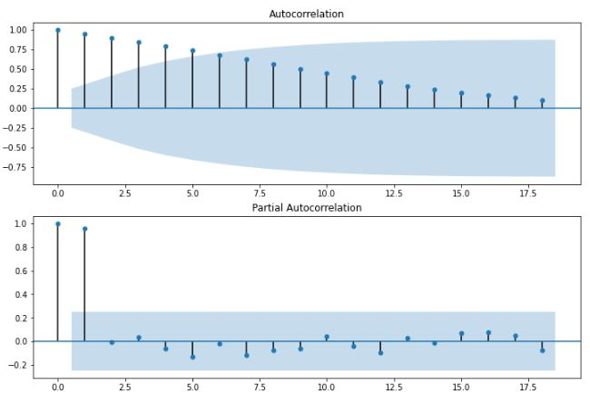
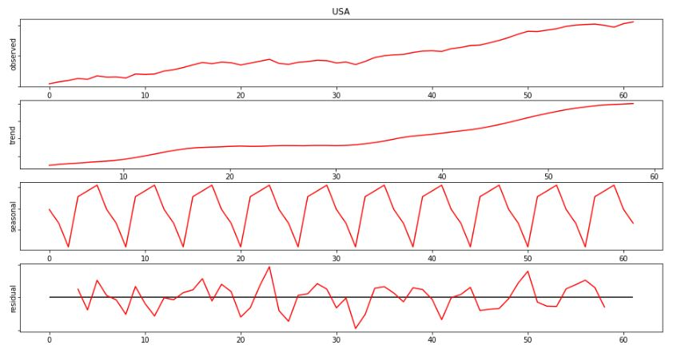
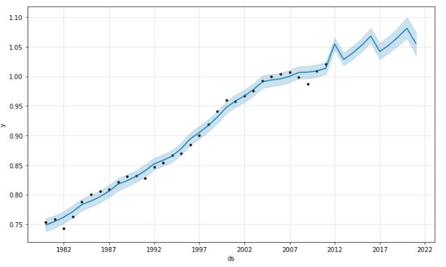
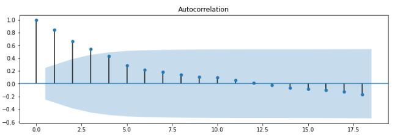
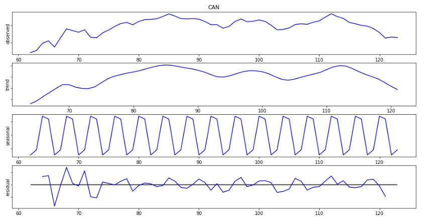
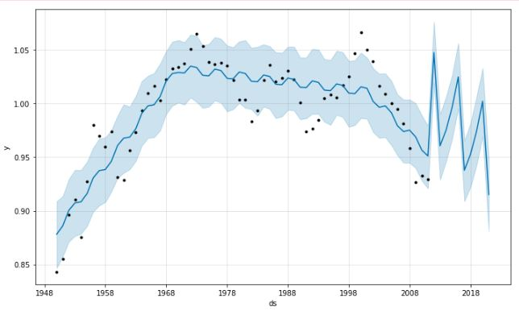

<h1><b>
Data Analysis Skill Test
</b></h1>

In this repository there are 2 cases developed for the selection process of 4 intelligences for Data Scientist.

<h2>CASE 1</h2>

Using `TFP.csv`:

<ol>
<h3><li><b>Make an exploratory data analysis</b></li></h3>
<dt>In the first, I did country data analysis as the image below.</dt>

<dt>And in the figure below, I made the plot by country to know if the data has any frequency.</dt>

<dt><b>We can conclude that Canada has a higher frequency value than other countries.</b></dt>

<h3><li><b>Forecast 10 years of the series</b></li></h3>
<dt>
The graph below shows whether there is a relationship between the previous period and the following period. They are divided by countries too: USA, CAN, MEX respectively.
</dt>

<dt>
<b>The more aligned the points are, the more relationship they have to each other. So we can say that among the 3 countries, the USA has a greater relationship between the following period and the previous period.</b>
</dt>

<h3><b>Forecast - USA</b></h3>
<dt>
The figure below shows the lollipop chart. In it, we can see that the lollipop number 6 goes into the range. So let's use number 6 as a repetition period for the forecast.
</dt>

<dt>
Descomposing a Time Series into: Mean / Trends /Seasonal Effects / Noise
</dt>
<dt>
Looking at the graph aelow we can see that both the trend and the observed value have a similarity, in additioin to having a sasonality, even wih the residual value having a hight variation.
</dt>

<dt>
Finally, we have a 10 year forecast from the USA in chart below. It is possible to observe that there is a small variation for forecast.
</dt>

<h3><b>Forecast - CAN</b></h3>
<dt>
Differente from the USA, in CAN we can see that the lollipop number 4 goes into the range. So let's use number 4 as a repetition period for the forecast.
</dt>

<dt>
Descomposing a Time Series into: Mean / Trends /Seasonal Effects / Noise

In the case of CAN, the trend and observed lines were also similar, in addition to a high sasonality. In the residual graph, we can see a hight variation in the early years and a smaller variation in the other years.
</dt>

<dt>
When looking at the graph, the variation seems quite large, but the forecast for 2018 is 0.974086 and for 2019 it is 1.002181.
</dt>

<h3><li><b>Can you think about another feature that could be helpful in explaning TFP series? Explain</b></li></h3>
</ol>