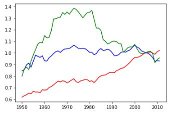
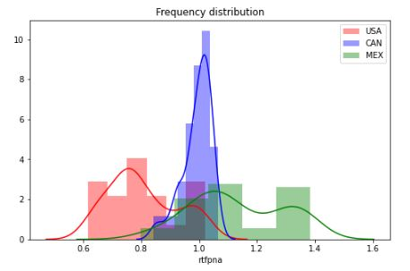
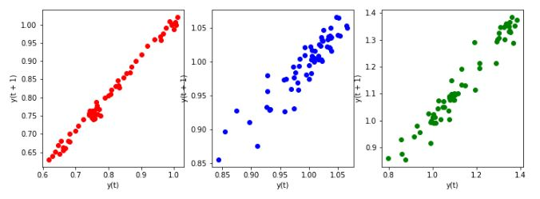

<h1><b>
Data Analysis Skill Test
</b></h1>

In this repository there are 2 cases developed for the selection process of 4 intelligences for Data Scientist.

<h2>CASE 1</h2>
Using ` TFP.csv`:
<ol>
<h3><li><b>Make an exploratory data analysis</b></li></h3>
<dt>In the first, I did country data analysis as the image below.</dt>

<dt>And in the figure below, I made the plot by country to know if the data has any frequency.</dt>

<dt><b>We can conclude that Canada has a higher frequency value than other countries.</b></dt>

<h3><li><b>Forecast 10 years of the series</b></li></h3>
<dt>The graph below shows whether there is a relationship between the previous period and the following period.They are divided by countries too: USA, CAN, MEX respectively.</dt>

<h3><li><b>Can you think about another feature that could be helpful in explaning TFP series? Explain</b></li></h3>
</ol>