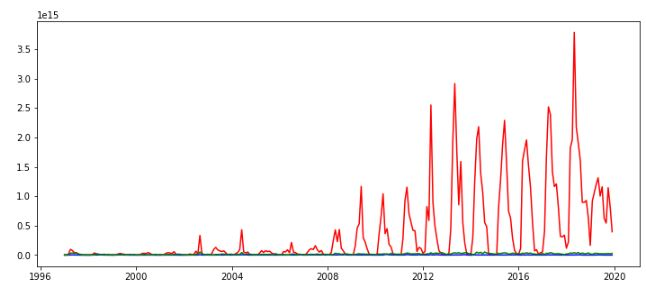

<h1><b>
Data Analysis Skill Test
</b></h1>

There are 2 cases developed for the selection process of 4 intelligences for Data Scientist in this repositor.

<h2>CASE 1</h2>

Using `TFP.csv`:

<ol>
<h3><li><b>Make an exploratory data analysis</b></li></h3>
<dt>First, I did country data analysis as the image below.</dt>

<dt>And in the next figure, there’s a plot by country to know if the data has any frequency.</dt>

<dt><b>When we analyse both pictures, we can conclude that Canada has a higher frequency value than other countries.
</b></dt>

<h3><li><b>Forecast 10 years of the series</b></li></h3>
<dt>
The graph below shows whether there is a relationship between the previous period and the following period. They are divided by countries too: USA, CAN, MEX respectively.
</dt>

<dt>
<b>The more aligned the points are means that more related they are. So we can say that among the 3 countries, the USA has a greater relationship between the following period and the previous period.</b>
</dt>

<h3><b>Forecast - USA</b></h3>
<dt>
The figure below shows the lollipop chart. In it, we can see that the lollipop number 6 goes into the range. So let's use number 6 as a repetition period for the forecast.
</dt>

<dt>
Descomposing a Time Series into: Mean, Trends, Seasonal Effects and Noise, we can see that both the trend and the observed value have a similarity, in additioin to having a sasonality, even wih the residual value having a hight variation.
</dt>

<dt>
Finally, we found a 10 year forecast from the USA in chart below. It is possible to observe that there is a small variation for forecast.
</dt>

<h3><b>Forecast - CAN</b></h3>
<dt>
Differente from the USA, in CAN we can see that the lollipop number 4 goes into the range. So let's use number 4 as a repetition period for the forecast.
</dt>

<dt>
Descomposing a Time Series into: Mean, Trends, Seasonal Effects and Noise, the trend and observed lines were also similar, in addition to a high sasonality. In the residual graph, we can observe a high variation in the early years and a smaller variation in the other years.
</dt>

<dt>
As it can analyze at the graph, the variation seems quite large, but the forecast for 2018 is 0.974086 and for 2019 it is 1.002181.
</dt>

<h3><b>Forecast - MEX</b></h3>
<dt>
In the case to MEX, we can see that the lollipop number 5 goes into the range. So let's use number 5 as a repetition period for the forecast.
</dt>

<dt>
Descomposing a Time Series into: Mean, Trends, Seasonal Effects and Noise, the trend and observed lines were also similar, in additiom to a high sasonality like CAN. In the residual graph, we can notice a high variation like USA.
</dt>

<dt>
Similar to CAN forecast, the variation seems quite large, but the forecast for 2018 is 0.964114 and for 2019 it is 0.998557.
</dt>

<h3><b>FORECAST  - 10 years</b></h3>

<dt>
This is the forecast graph with the 3 countries. We can notice a high similarity between MEX and CAN.
</dt>

<h3><li><b>Can you think about another feature that could be helpful in explaning TFP series? Explain</b></li></h3>
</ol>

<h2>CASE 2</h2>
<ol>
<h3><li><b>Show the evolution of total monthly and total annual exports from Brazil (all states and to everywhere) of ‘soybeans’, ‘soybean oil’ and ‘soybean meal’</b></li></h3>
<h3><b>Evolution of Total Monthly</b></h3>
<dt>
By placing the graphs on the side, we can see that the product scale is very similar if you are not careful to see the y-axis in which there is a big difference in the amount of soybeans and soybean meal.
</dt>

<dt>
But when placing on the same scale, it is possible to observe the difference in quantity between the products.
</dt>

<h3><b>Evolution of Total Annual</b></h3>
<dt>
For annual values, we can observe an increasing curve for soybeans and for soybeans meal, different from soybean oil.
</dt>

<dt>
When placed on the same scale, it's' difficult to visualize the drop in soybean oil exports.
</dt>

<h3><li><b>What are the 3 most important products exported by Brazil in the last 5 years?</b></li></h3>

<h3><li><b>What are the main routes through which Brazil have been exporting ‘corn’ in the last few years? Are there differences in the relative importancem of routes depending on the product?</b></li></h3>
<h3><li><b>Which countries have been the most important trade partners for Brazil in terms of ‘corn’ and ‘sugar’ in the last 3 years?</b></li></h3>
<h3><li><b>For each of the products in the dataset, show the 5 most important states in terms of exports?</b></li></h3>
<h3><li><b>Using `covariate.xlsx`: What should be the total brazilian soybeans, soybean_meal, and corn export forecasts, in tons, for the next 11 years (2020-2030)? We’re mostly interested in the annual forecast.</b></li></h3>

</ol>